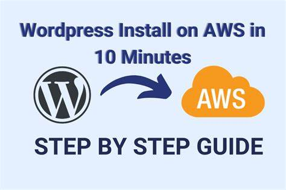

```markdown
# Deploying WordPress on AWS EC2

This tutorial provides a step-by-step guide to deploying WordPress on an Amazon EC2 instance.




## Prerequisites

- An active AWS account.
- An SSH key pair for accessing your EC2 instance.
- Basic familiarity with Linux commands.

## Step 1: Launch an EC2 Instance

1. **Log in to the AWS Console:**
   - Go to the AWS Management Console and log in.

   

2. **Launch an EC2 instance:**
   - Navigate to **Services** > **EC2** > **Instances** > **Launch Instances**.
   - Choose an Amazon Machine Image (AMI), preferably Ubuntu 20.04 or Amazon Linux 2 (free tier eligible).
   - Select an instance type, choose **t2.micro** (free tier eligible).

3. **Configure instance details:**
   - Leave storage settings as default.
   - Proceed to **Configure Security Group**.

4. **Set up the security group:**
   - Allow inbound traffic for:
     - **Port 22** (SSH)
     - **Port 80** (HTTP)
     - **Port 443** (HTTPS, optional but recommended)

   

5. **Download the key pair (PEM file):**
   - Ensure you download the PEM file for SSH connection and keep it secure.

## Step 2: Connect to the EC2 Instance

1. **SSH Connection:**
   - Use the command below to connect to your EC2 instance (replace `your-key.pem` and `ec2-user@instance-public-ip`):
     ```bash
     ssh -i your-key.pem ec2-user@instance-public-ip
     ```

   

## Step 3: Install Apache, MySQL, and PHP (LAMP Stack)

1. **Update packages:**
   ```bash
   sudo apt update && sudo apt upgrade -y
   ```

2. **Install Apache:**
   ```bash
   sudo apt install apache2 -y
   ```
   - Verify Apache is running by accessing the public IP of your EC2 instance in a web browser.

   

3. **Install MySQL:**
   ```bash
   sudo apt install mysql-server -y
   ```
   - Secure your MySQL installation:
     ```bash
     sudo mysql_secure_installation
     ```

4. **Install PHP:**
   ```bash
   sudo apt install php libapache2-mod-php php-mysql -y
   ```

## Step 4: Configure MySQL for WordPress

1. **Connect to MySQL:**
   ```bash
   sudo mysql
   ```

2. **Create a WordPress database and user:**
   ```sql
   CREATE DATABASE wordpress;
   CREATE USER 'wpuser'@'localhost' IDENTIFIED BY 'password';
   GRANT ALL PRIVILEGES ON wordpress.* TO 'wpuser'@'localhost';
   FLUSH PRIVILEGES;
   EXIT;
   ```

## Step 5: Install WordPress

1. **Download WordPress:**
   ```bash
   cd /tmp
   wget https://wordpress.org/latest.tar.gz
   tar -xvzf latest.tar.gz
   ```

2. **Copy WordPress files to Apache directory:**
   ```bash
   sudo cp -r wordpress/* /var/www/html/
   ```

3. **Set appropriate permissions:**
   ```bash
   sudo chown -R www-data:www-data /var/www/html/
   sudo chmod -R 755 /var/www/html/
   ```

4. **Configure WordPress:**
   - Rename the sample configuration file:
     ```bash
     cd /var/www/html/
     sudo mv wp-config-sample.php wp-config.php
     ```
   - Edit **wp-config.php** to add database details:
     ```bash
     sudo nano wp-config.php
     ```
     Update the following values:
     ```php
     define( 'DB_NAME', 'wordpress' );
     define( 'DB_USER', 'wpuser' );
     define( 'DB_PASSWORD', 'password' );
     define( 'DB_HOST', 'localhost' );
     ```

## Step 6: Complete WordPress Installation

1. **Access WordPress via a browser:**
   - Visit `http://instance-public-ip`.
   - Follow the setup instructions to finalize installation (choose language, create admin user, etc.).

   

## Step 7: Domain Configuration and SSL (Optional)

1. **Set up a domain name:**
   - Point a domain name to your EC2 instance by configuring an A record in your DNS manager, pointing to your instance's public IP.

2. **Install an SSL certificate with Let's Encrypt:**
   - Install Certbot to secure your site with HTTPS:
     ```bash
     sudo apt install certbot python3-certbot-apache -y
     sudo certbot --apache
     ```
   - Follow the prompts to generate and install the SSL certificate.

## Conclusion

Your WordPress instance on AWS EC2 is now up and running. You can access your site, customize themes, install plugins, and add content.

Feel free to reach out if you have any questions or need further assistance!
```

### Notes on Images
- **Placeholders:** Replace `path/to/your-image.png` with the actual paths to your images.
- **Images Usage:** Limit the number of images to those that clarify the steps, such as the AWS Console, security group settings, and the Apache test page.
- **Image Format:** Use PNG or JPG format for clear visuals.

If you need help with specific images or further modifications, let me know!
